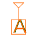
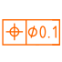

FreeCAD-GDT
===========

Geometric Dimensioning and Tolerancing (GD&T) workbench for FreeCAD

Please see [forum thread](https://forum.freecadweb.org/viewtopic.php?f=10&t=22072) to discuss or report issues regarding this Addon with it's author and the FreeCAD community.

Abstract
----------

The project is aimed at the development of a labeling software module for Geometric Dimensioning and Tolerancing (GD&T) in 2D and 3D technical drawings. The main contributions of this software are:

-	Allows the GD&T information to be added to the design itself, thus linking design, manufacturing and quality specifications.
-	Implements the [ISO16792](https://www.iso.org/fr/standard/73871.html) standard for both 2D and 3D parts.
-	Incorporates a homogeneous graphical interface and integrated with the technical design tools and 3D.
-	There is no precedent developed as free software.

The implementation of the software is done as a module of the parametric modeling free software application [FreeCAD](http://freecadweb.org). This is a multiplatform project since the development of the module is done with Python and FreeCAD has compilations for multiple Operating Systems.

The initial source code as been developped by [Juan Vañó Cerdá](https://github.com/juanvanyo) during his final master's work in university. He developed a module to solve the problem of Geometric Dimensioning and Tolerancing (GD&T) the initial source code is based on the [FreeCadDraft Workbench](https://wiki.freecad.org/Draft_Workbench) .

Installing
----------

Download and install your corresponding version of FreeCAD from [wiki Download page](http://www.freecadweb.org/wiki/Download) and either install
- automatically using the [FreeCAD Add-on Manager](https://github.com/FreeCAD/FreeCAD-addons) 
- manually by copying the FreeCAD-GDT folder to the Mod sub-directory of the FreeCAD application.

Operation of the module
----------

When doing a GD&T labeling, the first thing to do is to define an annotation plane on which the annotations you make will be created. To do this, first select a face of the piece and click the command on the toolbar add annotation plane. This will define a plane on that face and you can also apply an offset to place our annotation plane to the height you want in parallel on the selected face. Defining an annotation plane.

The next step you must do is to create a datum reference or a geometric tolerance. Although it is important to note that if the first thing to be created is a geometric tolerance, it can not contain any datum system since there will not be any created yet. However, this can be added later by modifying the geometric tolerance from the inventory of GD&T elements.

In all cases, when creating a reference or a geometric feature, the user must choose certain parameters that will define the element to be created. These include the annotation plane on which the annotation will be represented. Everything that follows must allow the selection of a point on the plane. This is the point on which the representation of the frame that will encapsulate the data of your annotation will start.

In addition, at any time, you can create a datum system with the created datum elements and this datum system can be applied to the geometric tolerances that you consider appropriate. This will indicate that said geometric tolerance will be applied to the face or faces corresponding to the annotation in relation to the datum references that make up the associated datum system.

Thereafter, if you wish to apply a reference or a geometric tolerance to one or more faces to which an annotation is already associated, this module will automatically detect this annotation and add the new element.

Therefore, the flow of our module could be summarized as follows: you need to add geometric tolerances to your drawing, but to do so, you first need to create different elements such as annotation planes to place our annotations where you want them, or references and datums to provide the necessary information for your geometric tolerances. So you have to create different elements until your part is completely labeled with all the geometric tolerances you need to indicate.

Commands
----------

-  Add Annotation Plane
-  Add Datum Feature
-  Add Annotation System
-  Add Geometric Tolerance
-  Inventory and modification of the elements of GD&T

----

### :scroll: License ? 
